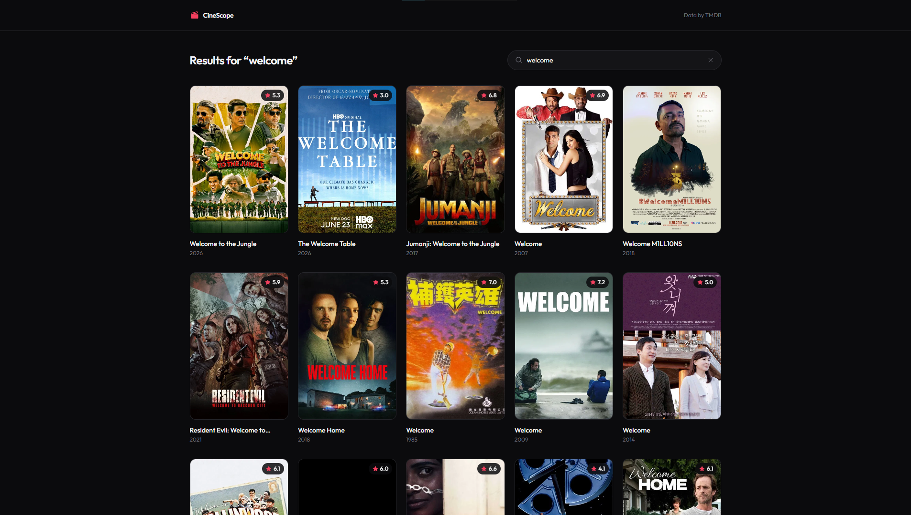

# CineScope 🎬

Movie discovery app: browse what's popular, search the full TMDB catalogue, open any film's details.

🔗 **Live demo:** _coming soon (Vercel)_ · 💻 **Code:** this repository



## Features

- Popular movies feed with pagination (TMDB REST API)
- Debounced search (400 ms) with **AbortController**: a slow old response can never overwrite a newer one
- Search state lives in the URL (`?q=...&page=...`), so results are shareable and the back button works
- Routing with React Router: `/` catalogue, `/movie/:id` details page
- Full state cycle: skeleton loaders, network error with retry, "nothing found" empty state
- SPA rewrites for Vercel (`vercel.json`), so refreshing `/movie/123` doesn't 404

## Stack

React · TypeScript · Vite · React Router · Tailwind CSS v4

## Run locally

```bash
npm install
cp .env.example .env   # then paste your TMDB key into .env
npm run dev
```

Get a free key at [themoviedb.org/settings/api](https://www.themoviedb.org/settings/api). Both the v3 API Key and the v4 Read Access Token work.

> **Note on the key:** any `VITE_`-prefixed variable is inlined into the client bundle, so the key is visible in DevTools on the deployed site. For a free TMDB key this is a deliberate, documented trade-off for a demo. The production-grade fix is proxying requests through a serverless function so the key never leaves the server.

## What I learned

Debounce alone doesn't make search correct: responses can arrive out of order, so each new request aborts the previous one via `AbortController` in the `useEffect` cleanup. Keeping query and page in the URL instead of component state made navigation and sharing work for free.
